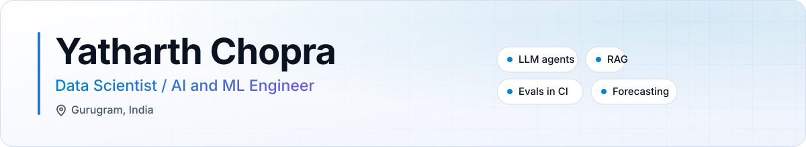
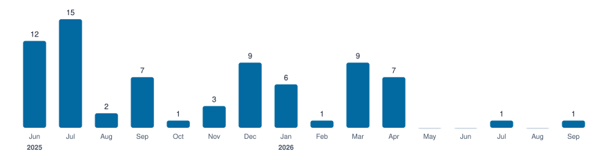
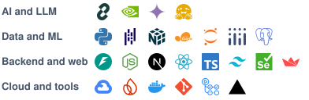

<picture>
  <source media="(prefers-color-scheme: dark)" srcset="assets/banner-v2-dark.svg">
  
</picture>

# Yatharth Chopra

Data Scientist / AI and ML Engineer in Gurugram. I build autonomous LLM agents and data systems, and I test them like normal software. Three internships so far: Notera Health AI, Agile Partners and ARB Bearing.

*Build it, break it, learn from it, then build it better.*

**Open to roles.** [LinkedIn](https://www.linkedin.com/in/yatharth-chopra--/) · [Email](mailto:yatharthchopra24@gmail.com)

     

## How I work

I like building agents that can work on their own. They plan, use tools, check their own work and say what they could not verify. Then I test them properly: my agent projects ship with eval suites that run in CI and fail the build when quality drops.

## Featured projects

- **[Notera Health AI](https://github.com/SA-Medicine/Notera-Health-Ai)** `LLM pipeline` `LLM as judge` `regression gate` Clinical transcripts to SOAP notes, as the only engineer. A judge harness scored 2,987 records on five clinical metrics, and a regression gate blocks bad releases.
- **[OSINT Scout](https://github.com/yatharthchopra2424/OSINT-Scout-Ainos)** `Python` `LangGraph` `NVIDIA Nemotron` `CI evals` Account monitoring agent where every fact cites its source. 63 tests and a nine metric eval on every push ([runs](https://github.com/yatharthchopra2424/OSINT-Scout-Ainos/actions/workflows/eval.yml)).
- **[Veridian IT Desk Agent](https://github.com/yatharthchopra2424/Internal_Service_Agent_AINOS)** ([demo](https://veridian-it-desk-agent.onrender.com/#try)) `LangGraph` `Nemotron` `hybrid retrieval` `audit trail` IT support agent that resolves, asks, routes or escalates. 14 gates in CI, recall@3 of 1.000 against 0.891 for keyword search ([results](https://github.com/yatharthchopra2424/Internal_Service_Agent_AINOS#proof-the-eval-harness)).
- **[GridCast](https://github.com/yatharthchopra2424/GridCast)** ([demo](https://gridcast-ai.vercel.app/)) `XGBoost` `LSTM` `FastAPI` `React` Grid load forecasting on real NRLDC data, team project. XGBoost beat the LSTM at every horizon, MAPE 1.69% at 24h ([results](https://github.com/yatharthchopra2424/GridCast#model-evaluation--comparison)).
- **[Bajaj Policy RAG](https://github.com/yatharthchopra2424/Bajaj-Policy-MVP-Rag)** `FastAPI` `FAISS` `LangChain` `React` RAG over insurance PDFs, Excel files and scans with hybrid search. Hackathon finalist.

More: [Scheme Intelligence Pipeline](https://github.com/yatharthchopra2424/Schemes_scrapper), [HealthAI Directory](https://github.com/yatharthchopra2424/EY-Project-Healthcare-Provider-Directory-AI), [Velorium](https://github.com/yatharthchopra2424/employee-attrition-prediction), [FloatCast AI](https://github.com/yatharthchopra2424/floatcast-ai), [LexiPro](https://github.com/yatharthchopra2424/LEXIPRO), and the rest in my [repositories](https://github.com/yatharthchopra2424?tab=repositories).

## Hackathons

- **Bajaj RAG hackathon**: finalist, with the [Bajaj Policy RAG](https://github.com/yatharthchopra2424/Bajaj-Policy-MVP-Rag) project above.
- **FedEx SMART Challenge, IIT Madras** (Dec 2024): finalist among 2,500+ participants, with a logistics solution targeting 25% lower emissions.

## Experience

- **Software development engineer intern, [Notera Health AI](https://github.com/SA-Medicine/Notera-Health-Ai)**, May to Aug 2026. Built the LLM pipeline and the evaluation and regression harnesses described above, as the sole engineer.
- **LLM engineer intern, Agile Partners**, Sep 2025 to Feb 2026. Built the resume generation pipeline for [an AI job search platform](https://github.com/agilepartners-ai/AIJobSearchAgent) with prompt chaining over Gemini on Vertex AI, limited to facts from the profile and the job description. Also built the Firebase layer and the Next.js API routes. It runs in production at [agilepartners-ai.com](https://agilepartners-ai.com) through Cloud Run and GitHub Actions. 49 merged pull requests from me in the public repo.
- **Data analyst intern, ARB Bearing**, Jun to Aug 2025. Built a Power BI, SQL and Python reporting system over 150,000+ live records from IoT instrumented machines. Automated 5 departmental reports, from one week down to same day. The dashboard is still used by directors and department heads.
- **B.Tech CSE (Data Science)**, graduating 2027.

## Merged pull requests

74 merged pull requests in public team and organisation repos since Jun 2025: 49 in AIJobSearchAgent, 14 in MyJobSearchAgent, 10 in GridCast, 1 in Notera Health AI.

<picture>
  <source media="(prefers-color-scheme: dark)" srcset="assets/merged-prs-dark.svg">
  
</picture>

Latest:

- 26 Sep 2026: [AIJobSearchAgent](https://github.com/agilepartners-ai/AIJobSearchAgent/pull/158), fix(deps): patch all critical Dependabot alerts
- 7 Jul 2026: [Notera-Health-Ai](https://github.com/SA-Medicine/Notera-Health-Ai/pull/1), feat: improve clinical note generation pipeline, update schemas
- 23 Apr 2026: [GridCast](https://github.com/Team-NAVGATI/GridCast/pull/46), feat: standardise dropdown UI and fix dark-mode visibility issues
- 5 Apr 2026: [AIJobSearchAgent](https://github.com/agilepartners-ai/AIJobSearchAgent/pull/156), feat: comprehensive UI/UX overhaul and new sections
- 5 Apr 2026: [GridCast](https://github.com/Team-NAVGATI/GridCast/pull/42), fix: un-ignore lib folder and stage frontend lib scripts
- 1 Jul 2025: [MyJobSearchAgent](https://github.com/agilepartners-ai/MyJobSearchAgent/pull/63), feat: Add Upgrade Pro button to AI Interview page navbar

## Tools

<picture>
  <source media="(prefers-color-scheme: dark)" srcset="assets/tools-v2-dark.svg">
  
</picture>

Also: SQL, Power BI, Tableau, Pinecone, AWS EC2, XGBoost, LightGBM, SHAP, Matplotlib and Seaborn.

Certifications

- [Oracle Cloud Infrastructure 2025 Certified Data Science Professional](https://catalog-education.oracle.com/pls/certview/sharebadge?id=B89CA5B081D2352891C8E45F01B9400EF6363018496EC3AD65230ACF60C44E9A), Oct 2025
- [Oracle Cloud Infrastructure 2025 Certified AI Foundations Associate](https://catalog-education.oracle.com/pls/certview/sharebadge?id=0E1306AD4BC6336D18C9E2EAC4411F4DCD9DB033D9EB27501759D8278C011275), Nov 2025
- [IBM Machine Learning with Python (ML0101EN)](https://courses.cognitiveclass.ai/certificates/5ed7f2cd13d1417682807551c2cd3946), Nov 2025
- Google Data Analytics Professional Certificate, Oct 2024
- ISRO remote sensing data analytics in crop production forecasting, Jul 2025

## Now

Building autonomous agents with proper evals. Looking for data scientist, AI engineer and LLM engineer roles. Based in Gurugram, open to relocate and remote.

## Contact

<a href="https://www.linkedin.com/in/yatharth-chopra--/"><picture>
  <source media="(prefers-color-scheme: dark)" srcset="assets/contact-linkedin-dark.svg">
  
</picture></a>
<a href="mailto:yatharthchopra24@gmail.com"><picture>
  <source media="(prefers-color-scheme: dark)" srcset="assets/contact-email-dark.svg">
  
</picture></a>

Open to data scientist, AI engineer and LLM engineer roles.
<!-- portfolio link goes here when the site is ready -->

Last updated October 2026.
